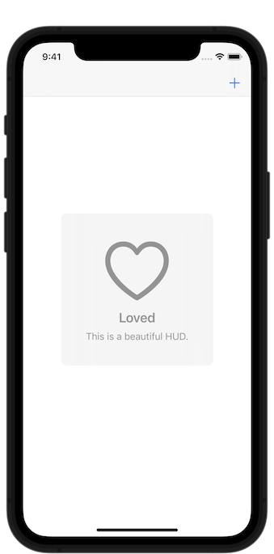
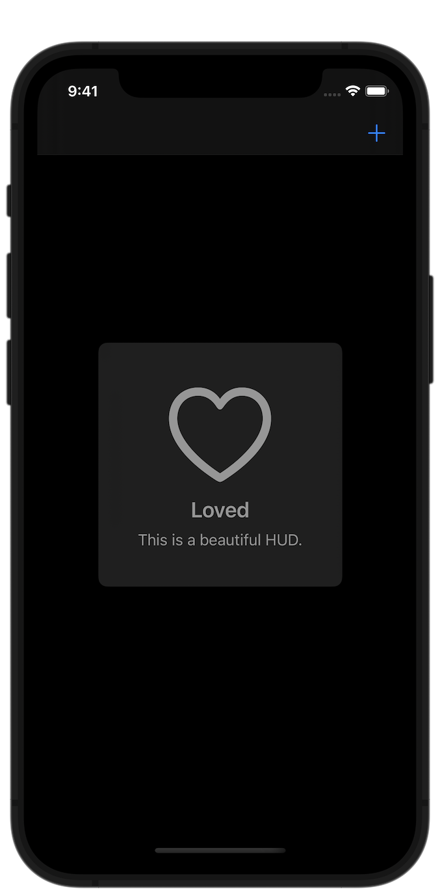

# HUD

A modern HUD inspired by Apple Music and Apple Podcasts.

 

## How to Use

```swift
import HUD

let hud = HUD(
    image: UIImage(systemName: "heart"),
    title: "Loved",
    message: "This is a beautiful HUD."
)
window.show(hud)
```
