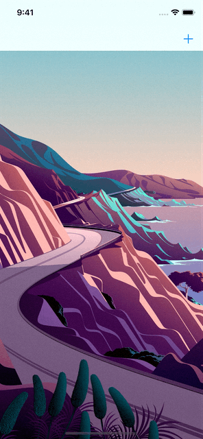
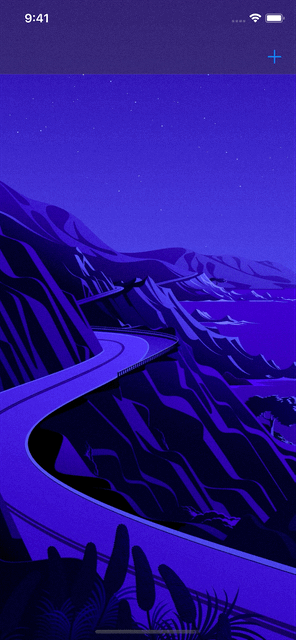
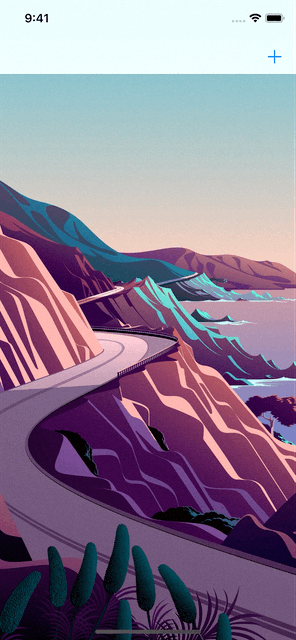

# HUD

A modern HUD inspired by Apple Music and Apple Podcasts.

Appearance             | Light                                             | Dark
---------------------- | ------------------------------------------------- | ------------------------------------------------
HUD                    |                     | 
Activity Indicator HUD |  | 


## Requirements

- iOS 13+

## How to Use

```swift
import HUD

let hud = HUD(
    image: UIImage(systemName: "heart"),
    title: "Loved",
    message: "This is a beautiful HUD."
)
window.show(hud)
```
